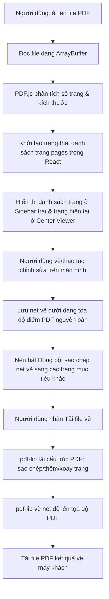

# 1. Kiến Trúc Hệ Thống (Architecture Overview)

Tài liệu này giải thích tổng quan về kiến trúc của ứng dụng **PDFSuper Editor**, cấu trúc thư mục, các thư viện sử dụng và cách chuyển đổi tọa độ giữa giao diện hiển thị (Canvas) và file PDF gốc.

---

## 1. Cấu trúc thư mục dự án

Dự án được xây dựng trên nền tảng **Vite + React** với cấu trúc thư mục tối giản và tối ưu:

```text
pdfsuper/
├── docs/                      # Thư mục chứa tài liệu giải thích chi tiết
│   ├── 1.kientruc.md          # Tổng quan kiến trúc & ánh xạ tọa độ
│   ├── 2.laplacian_inpaint.md # Giải thuật xóa hòa nhập (Laplacian Inpainting)
│   ├── 3.dongbo.md            # Cơ chế sửa đổi đồng bộ (Batch Page Sync)
│   └── 4.chinhsuapdf.md       # Cơ chế chỉnh sửa & xuất bản PDF (pdf-lib)
├── src/
│   ├── assets/                # Các tài nguyên tĩnh (hình ảnh, icons...)
│   ├── utils/
│   │   ├── inpaint.js         # Thuật toán giải Laplace giải quyết việc xóa hòa nhập
│   │   └── pdfHelper.js       # Các hàm bổ trợ xử lý xuất bản PDF
│   ├── App.css
│   ├── App.jsx                # Component chính chứa giao diện & logic nghiệp vụ
│   ├── index.css              # Hệ thống CSS tùy chỉnh (Dark Theme, Glassmorphism)
│   └── main.jsx               # Điểm khởi chạy ứng dụng React
├── package.json
└── vite.config.js
```

---

## 2. Các thư viện cốt lõi sử dụng

Để thực hiện chỉnh sửa PDF 100% ở phía client (không thông qua server để bảo mật và tốc độ cao), ứng dụng tích hợp 3 thư viện chính:

1. **`pdfjs-dist` (PDF.js của Mozilla)**:
   - *Mục đích*: Đọc file PDF gốc, giải mã các trang và vẽ nội dung lên phần tử HTML5 `<canvas>`.
   - *Đặc điểm*: Cung cấp công cụ tính toán tỷ lệ, hướng xoay trang và hỗ trợ hàm tiện ích chuyển đổi tọa độ.
   - *Worker*: Cấu hình worker cục bộ thông qua tính năng nhập tài sản của Vite (`?url`) để chạy ngoại tuyến (offline) hoàn toàn.

2. **`pdf-lib`**:
   - *Mục đích*: Sửa đổi cấu trúc của tệp PDF (thêm trang trống, sao chép trang, xóa trang, thay đổi thứ tự và xoay trang) và vẽ trực tiếp các vector/ảnh đè lên trang PDF gốc để đóng gói xuất bản.
   - *Đặc điểm*: Bảo toàn chất lượng vector của văn bản gốc trong PDF (văn bản vẫn có thể bôi đen/copy được), chỉ thực hiện đè nét vẽ/ảnh inpaint tại những vị trí chỉ định.

3. **`lucide-react`**:
   - *Mục đích*: Cung cấp hệ thống icon chất lượng cao, đồng nhất, giúp giao diện trông hiện đại và chuyên nghiệp.

---

## 3. Quy trình hoạt động của ứng dụng (Data Flow)



---

## 4. Chuyển đổi tọa độ (Coordinate Mapping)

Đây là phần phức tạp nhất trong việc chỉnh sửa PDF. File PDF và HTML5 Canvas có hai hệ tọa độ hoàn toàn khác nhau:

### 1. Hệ tọa độ HTML5 Canvas (Thiết bị hiển thị)
- **Gốc tọa độ (0, 0)**: Nằm ở góc **trên-bên-trái** của Canvas.
- **Trục X**: Tăng dần từ trái qua phải.
- **Trục Y**: Tăng dần từ trên xuống dưới.
- **Kích thước**: Phụ thuộc vào mức độ phóng to/thu nhỏ (`zoom` hay còn gọi là `scale`).

### 2. Hệ tọa độ PDF nguyên bản (User Unit Space)
- **Gốc tọa độ (0, 0)**: Nằm ở góc **dưới-bên-trái** của trang giấy.
- **Trục X**: Tăng dần từ trái qua phải.
- **Trục Y**: Tăng dần từ dưới lên trên.
- **Kích thước**: Đo bằng Point (1 point = 1/72 inch). Kích thước trang A4 chuẩn thường là $595.276 \times 841.890$ points.

### Giải pháp Ánh xạ tọa độ bằng PDF.js Viewport
PDF.js cung cấp đối tượng `PageViewport` sau khi render trang. Đối tượng này chứa sẵn ma trận chuyển đổi tọa độ và hai hàm vô cùng mạnh mẽ:
- `viewport.convertToPdfPoint(x, y)`: Đổi tọa độ pixel trên canvas (tính từ top-left) thành tọa độ PDF (tính từ bottom-left).
- `viewport.convertToViewportPoint(pdfX, pdfY)`: Đổi tọa độ PDF thành tọa độ pixel trên canvas.

**Quy trình chuyển đổi khi người dùng vẽ một hộp (Box) trên Canvas:**
1. Người dùng kéo chuột tạo hộp có góc trên-trái là `(x1, y1)` và góc dưới-phải là `(x2, y2)` trên canvas.
2. Đổi 2 điểm góc này sang PDF:
   - `[pdfX1, pdfY1] = viewport.convertToPdfPoint(x1, y1)`
   - `[pdfX2, pdfY2] = viewport.convertToPdfPoint(x2, y2)`
3. Do trục Y của PDF ngược với Canvas, ta tính hình chữ nhật chuẩn trong PDF:
   - $X_{pdf} = \min(pdfX1, pdfX2)$
   - $Y_{pdf} = \min(pdfY1, pdfY2)$
   - $Width_{pdf} = |pdfX1 - pdfX2|$
   - $Height_{pdf} = |pdfY1 - pdfY2|$
4. Toàn bộ thông tin $X_{pdf}, Y_{pdf}, Width_{pdf}, Height_{pdf}$ được lưu vào cấu trúc dữ liệu của nét vẽ. Nhờ lưu bằng tọa độ PDF nguyên bản, dù chúng ta phóng to/thu nhỏ màn hình (zoom thay đổi), nét vẽ vẫn sẽ được hiển thị chính xác ở vị trí cũ sau khi tính toán lại qua hàm `convertToViewportPoint`.
