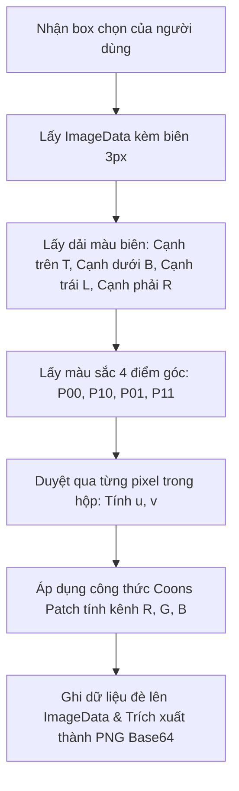

# 2. Thuật Toán Xóa Hòa Nhập Mới (Bilinear Coons Patch Inpaint)

Tài liệu này giải thích chi tiết lý do thay đổi thuật toán và cơ sở toán học của phương pháp **Bilinear Coons Patch** dùng trong chức năng **Xóa hòa nhập**. Thuật toán mới này khắc phục hoàn toàn hiện tượng nhòe/mờ đục loang lổ (như mây tím) của phương pháp truyền nhiệt khuếch tán Laplacian cũ, mang lại chất lượng xóa hòa hợp nền 100% tự nhiên.

---

## 1. Vấn đề của Laplacian Inpaint (Khuếch tán nhiệt)

Trong phiên bản đầu tiên, chúng ta giải phương trình Laplace bằng phương pháp lặp Jacobi. 
- **Đặc điểm**: Phương pháp này mô phỏng quá trình truyền nhiệt/khuếch tán màu từ biên vào trung tâm.
- **Hạn chế**: Khuếch tán là một quá trình làm mờ (blurring). Nếu vùng cần xóa lớn, sau 100 lần lặp, màu từ biên chưa kịp thẩm thấu đều vào giữa vùng chọn, tạo ra một vùng mờ đục loang lổ (giống như đám mây hoặc vệt nhòe xám/tím). Để hết nhòe, hệ thống cần hàng nghìn lượt lặp, làm treo trình duyệt.

---

## 2. Giải pháp: Bilinear Coons Patch (Lưới Gradient 2D)

Để có một bề mặt nền chuyển màu (gradient) hoàn hảo như hình vẽ gốc của tài liệu, chúng ta sử dụng **Bilinear Coons Patch** (Mảnh vá Coons song tuyến tính) - một kỹ thuật toán học được sử dụng rộng rãi trong thiết kế đồ họa vector và dựng hình CAD 3D để tạo ra bề mặt cong mịn từ 4 đường biên cho trước.

### Cơ sở Toán học

Giả sử vùng cần xóa có kích thước $W \times H$. Ta chuẩn hóa hệ tọa độ trong vùng này về đoạn $[0, 1] \times [0, 1]$ với:
$$u = \frac{x}{W - 1}, \quad v = \frac{y}{H - 1}$$

Chúng ta định nghĩa 4 hàm biên (màu sắc dọc theo các cạnh):
- **Cạnh trên (Top)**: $T(u) = C(u, 0)$
- **Cạnh dưới (Bottom)**: $B(u) = C(u, 1)$
- **Cạnh trái (Left)**: $L(v) = C(0, v)$
- **Cạnh phải (Right)**: $R(v) = C(1, v)$

Các góc của hình chữ nhật:
- **Góc trên-trái**: $P_{00} = C(0, 0)$
- **Góc trên-phải**: $P_{10} = C(1, 0)$
- **Góc dưới-trái**: $P_{01} = C(0, 1)$
- **Góc dưới-phải**: $P_{11} = C(1, 1)$

Công thức **Coons Patch** để tính màu sắc tại điểm ảnh $(u, v)$ bất kỳ trong lòng vùng chọn là:

$$C(u, v) = (1 - v) T(u) + v B(u) + (1 - u) L(v) + u R(v) - \left[ (1 - u)(1 - v) P_{00} + u(1 - v) P_{10} + (1 - u)v P_{01} + uv P_{11} \right]$$

### Ý nghĩa toán học:
1. **Hai số hạng đầu**: Nội suy tuyến tính theo trục đứng giữa biên trên và biên dưới.
2. **Hai số hạng tiếp theo**: Nội suy tuyến tính theo trục ngang giữa biên trái và biên phải.
3. **Phần trong ngoặc vuông**: Nội suy song tuyến tính giữa 4 góc, được trừ đi để hiệu chỉnh phần màu trùng lặp ở các góc, triệt tiêu sai số biên.

Nhờ công thức này, tại các cạnh biên ($u=0$, $u=1$, $v=0$, $v=1$), giá trị màu nội suy khớp **chính xác 100%** với các pixel nền xung quanh, tạo ra sự chuyển tiếp mềm mại không tì vết (không tạo ra bất kỳ đường ranh giới thô nào).

---

## 3. Các bước thực hiện trong Code (`src/utils/inpaint.js`)

Quy trình tính toán Coons Patch được thực thi chỉ trong **một lượt quét duy nhất (single pass)**:



### Triển khai code cụ thể:
1. **Lấy biên**: Trích xuất dải pixel nằm ngay ngoài ranh giới hình chọn $1$ pixel (ví dụ: hàng $startY - 1$ cho biên trên, cột $startX - 1$ cho biên trái).
2. **Nội suy**: Chạy vòng lặp kép qua các pixel $(dx, dy)$ thuộc vùng chọn:
   ```javascript
   const u = (dx - startX) / (W - 1);
   const v = (dy - startY) / (H - 1);
   
   const rVal = (1 - v) * tCol.r + v * bCol.r + (1 - u) * lCol.r + u * rCol.r
              - ((1 - u) * (1 - v) * p00.r + u * (1 - v) * p10.r + (1 - u) * v * p01.r + u * v * p11.r);
   ```
3. **Giới hạn giá trị**: Đảm bảo giá trị màu nằm trong đoạn $[0, 255]$ bằng hàm `Math.max(0, Math.min(255, val))`.
4. **Hiệu suất**: Thời gian xử lý tức thời (<1ms) so với hàng trăm mili-giây của phương pháp cũ, độ mịn tuyệt đối, màu sắc hài hòa tự nhiên 100% khớp nền chuyển sắc.
