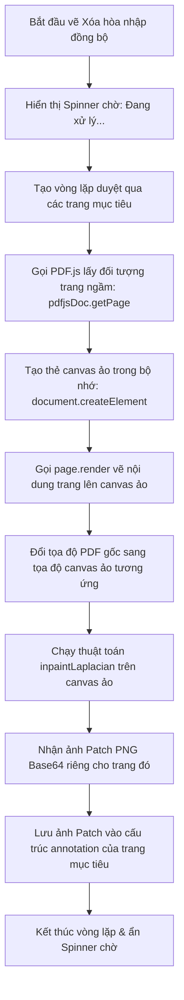

# 3. Cơ Chế Sửa Đồng Bộ (Batch Page Sync)

Tài liệu này giải thích chi tiết cách ứng dụng triển khai chức năng **Sửa đồng bộ** (Batch Page Sync). Chức năng này cho phép người dùng chỉ cần vẽ hình chữ nhật xóa logo một lần trên trang hiện tại, hệ thống sẽ tự động áp dụng thao tác xóa tương tự tại đúng vị trí đó trên nhiều trang khác nhau.

---

## 1. Các chế độ đồng bộ (Sync Modes)

Ứng dụng hỗ trợ hai chế độ đồng bộ tùy chỉnh linh hoạt:
1. **Tất cả các trang khác (All other pages)**: Áp dụng nét chỉnh sửa lên toàn bộ các trang còn lại trong tài liệu trừ trang gốc đang chỉnh sửa.
2. **Chọn thủ công (Manual Selection)**: Khi bật chế độ này, ở sidebar bên trái bên cạnh mỗi trang sẽ xuất hiện một ô Checkbox. Người dùng tích chọn những trang nào thì các nét sửa đổi mới được áp dụng lên trang đó. Trang đang chỉnh sửa sẽ được khóa checkbox và đánh dấu là "Trang gốc".

---

## 2. Thiết kế luồng dữ liệu (Data & Logic Flow)

Trạng thái đồng bộ được điều khiển bởi 3 biến State trong React:
- `syncEdits` (boolean): Bật/Tắt chế độ đồng bộ.
- `syncMode` (string: `'all' | `'manual'`): Chế độ đồng bộ.
- `selectedSyncPages` (Array): Danh sách ID của các trang được người dùng tích chọn thủ công.

Sử dụng React `useMemo` để tính toán động danh sách các ID trang mục tiêu cần đồng bộ (`targetPageIdsForSync`), loại bỏ trang hiện tại để tránh lặp đè:
```javascript
const targetPageIdsForSync = useMemo(() => {
  if (!syncEdits) return [];
  if (syncMode === 'all') {
    return pages.filter(p => p.id !== currentPageId).map(p => p.id);
  } else {
    return selectedSyncPages.filter(id => id !== currentPageId);
  }
}, [syncEdits, syncMode, pages, currentPageId, selectedSyncPages]);
```

---

## 3. Cách xử lý đối với từng loại công cụ

Khi người dùng hoàn tất vẽ một vùng trên trang hiện tại, hệ thống sẽ trích xuất tọa độ PDF nguyên bản $Rect_{pdf} = \{x, y, w, h\}$. Quá trình đồng bộ được thực hiện dựa trên loại công cụ:

### 1. Đối với công cụ Highlight và Xóa che màu (Solid Cover)
Đây là các công cụ vẽ hình học vector thuần túy, không phụ thuộc vào pixel nền.
- **Cách thực hiện**: Hệ thống nhân bản trực tiếp tọa độ $Rect_{pdf}$ và màu sắc đã chọn sang cho tất cả các trang mục tiêu (`targetPageIdsForSync`) và thêm trực tiếp vào danh sách `annotations` của chúng.
- **Tốc độ**: Ngay lập tức (Instantaneous), giao diện cập nhật ngay trong vài mili-giây.

### 2. Đối với công cụ Xóa hòa nhập (Inpaint/Blend Delete)
Đây là công cụ xử lý ảnh bitmap. Mỗi trang PDF có nội dung/hình ảnh và điểm pixel nền khác nhau tại vị trí logo (mặc dù logo có cùng tọa độ). Do đó, chúng ta **không thể sao chép trực tiếp ảnh patch** đã hòa nhập của trang hiện tại sang trang khác. Nếu làm vậy, nền của trang khác sẽ bị loang lỗ vì lệch màu nền gốc.
- **Giải pháp**: Phải chạy giải thuật Laplacian Inpainting độc lập trên **từng trang mục tiêu**, sử dụng dữ liệu pixel nền của chính trang đó tại tọa độ chỉ định.

---

## 4. Quy trình xử lý Xóa hòa nhập ngầm (Offscreen Inpaint)

Đối với các trang mục tiêu đang không hiển thị trên màn hình, làm sao để lấy dữ liệu pixel của chúng để chạy inpaint? Chúng ta giải quyết bằng cách **Render ngầm trong bộ nhớ** thông qua các bước sau:



### Hàm xử lý ngầm trong code:
```javascript
const applyInpaintToPage = async (pageConfig, pdfRect, scale) => {
  if (pageConfig.originalIndex === null) return null; // Bỏ qua trang trống
  
  // 1. Tải trang từ PDF.js
  const page = await pdfjsDoc.getPage(pageConfig.originalIndex);
  
  // 2. Tạo viewport với hướng xoay của trang đó
  const viewport = page.getViewport({ scale, rotation: pageConfig.rotation });
  
  // 3. Tạo canvas ảo ẩn
  const canvas = document.createElement('canvas');
  canvas.width = viewport.width;
  canvas.height = viewport.height;
  const ctx = canvas.getContext('2d');
  
  // 4. Render trang lên canvas ảo
  await page.render({ canvasContext: ctx, viewport }).promise;
  
  // 5. Ánh xạ ngược tọa độ PDF về tọa độ Canvas ảo
  const p1 = viewport.convertToViewportPoint(pdfRect.x, pdfRect.y);
  const p2 = viewport.convertToViewportPoint(pdfRect.x + pdfRect.w, pdfRect.y + pdfRect.h);
  
  const rect = {
    x: Math.min(p1[0], p2[0]),
    y: Math.min(p1[1], p2[1]),
    w: Math.abs(p1[0] - p2[0]),
    h: Math.abs(p1[1] - p2[1])
  };
  
  // 6. Chạy thuật toán xóa hòa nhập
  return inpaintLaplacian(ctx, rect, 100);
};
```

Nhờ cơ chế xử lý song song (`Promise.all`), việc xóa hòa nhập đồng bộ trên hàng chục trang diễn ra cực kỳ nhanh chóng (chỉ từ 1 - 2 giây), đảm bảo logo biến mất đồng loạt trên tất cả các trang một cách hoàn hảo và tự nhiên nhất.
